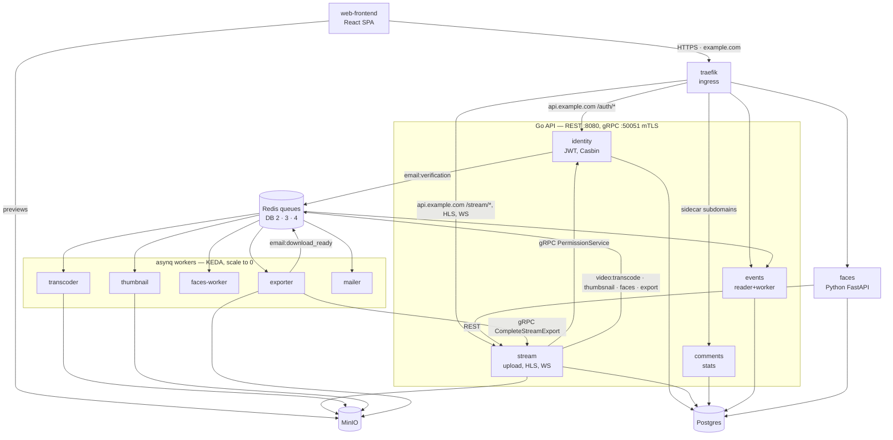

# GoCast

Monorepo for a video hosting/streaming platform: a React SPA frontend (`services/web-frontend`)
plus Go microservices (identity, stream, transcoder, thumbnail, mailer, events, comments, stats)
and a Python face-detection service (`faces-service`/`faces-worker`), deployed on a **k3s** cluster
in WSL.

## Repository structure

```
.
├── Makefile                 # entry points: all / render / infra / apply-traefik / apply-db-migrate / apps / apply-prometheus / apply-alertmanager / apply-grafana / status / backup / restore / build-web
├── .env                     # single non-secret config source (gitignored)
├── .env.example             # example config (committed)
├── scripts/
│   ├── render-env.sh        # .env -> K8s ConfigMaps (deploy/generated/configmaps/)
│   ├── backup.sh            # pg_dump + mc mirror -> deploy/backups/<ts>/
│   └── restore.sh           # restore postgres + minio from a backup
├── deploy/
│   ├── generated/configmaps/   # ConfigMaps produced by `make render` (gitignored)
│   ├── generated/ingresses/    # Ingresses rendered from DOMAIN_* envs (gitignored)
│   ├── backups/                # backups from `make backup` (gitignored)
│   └── k8s/
│       ├── prometheus/         # lightweight Prometheus server (no PVC)
│       ├── grafana/            # Grafana UI (provisioned datasource + GoCast dashboards)
│       ├── alertmanager/       # Prometheus alert receiver (UI/API, no notifiers by default)
│       └── traefik/            # plain-manifest traefik (unbundled from helm, hostNetwork)
└── services/
    ├── identity-service/    # Go: auth (JWT), users, RBAC (Casbin), gRPC permissions
    ├── stream-service/      # Go: upload (simple + multipart), HLS, thumbnails, WebSocket, MinIO
    ├── transcoder-service/  # Go + ffmpeg: `cmd/worker` (HLS), `cmd/exporter` (MP4), KEDA-scaled
    ├── thumbnail-service/   # Go + ffmpeg: preview generation, KEDA-scaled asynq worker
    ├── mailer-service/      # Go: asynq SMTP mailer (email verification), KEDA-scaled worker
    ├── events-service/      # Go: activity feed (REST reader + asynq worker), KEDA-scaled
    ├── comments-service/    # Go: comments & replies (markdown, keyset pagination, rate limits)
    ├── stats-service/       # Go: likes/dislikes & view counts, own `stats` database
    ├── faces-service/       # Python (FastAPI): face detection — infer, clusters, crops
    ├── faces-worker/        # Python: asynq worker for the face pipeline (detect/merge)
    ├── shared/              # shared Go module (gocast infra): worker, config, grpctls, metrics
    ├── db-migrate/          # golang-migrate runner for per-service schemas (Postgres)
    └── web-frontend/        # React 19 SPA (Vite, Tailwind 4, RTK Query, HLS.js)
```

## Architecture (summary)

- **REST/WS** to the outside world is served by **stream-service** (`/stream/*`, HLS
  `/stream/:id/hls/*file`, WS `/stream/ws/updates`) and **identity-service** (`/auth/*`).
- **gRPC (mTLS)** between services: identity ↔ stream ↔ thumbnail/transcoder. Certificates come
  from cert-manager `local-ca`; each service has its own OU, servers require a client cert and
  enforce OU allow-lists.
- **Auth:** JWT access + refresh (identity). RBAC roles **Admin/Member** via Casbin
  (`keyMatch2` + role groups). Policies live in the Postgres `casbin_rule` table (gorm-adapter);
  a **Redis pub/sub watcher** (channel `/casbin`) keeps multi-pod enforcers in sync.
- **Video:** upload to MinIO → asynq task to transcoder (KEDA-scaled) → HLS in MinIO →
  served by stream-service. Thumbnails are generated by a second asynq worker (thumbnail).
- **MP4 export:** `POST /stream/:id/export` queues `video:export` onto a **separate** asynq queue
  in **Redis DB 4** (`cmd/exporter` — a third ffmpeg worker inside transcoder-service), so muxing
  a multi-gigabyte rendition can never queue behind, or starve, a transcode.
- **Public services** each get their own ingress subdomain rendered from `.env`:
  `events.<DOMAIN>`, `comments.<DOMAIN>`, `stats.<DOMAIN>`, `faces.<DOMAIN>` — small Go/Python
  services with their own rate limits, queues and (where noted) databases.
- **Database schema** is versioned with **golang-migrate** (`services/db-migrate`), not GORM
  AutoMigrate — see "Schema migrations" below.
- **Functions of frontend** are built with build-time URLs from `.env` (`VITE_*`).

## Architecture diagram

Arrows are request or data flow. Only the export callback back into stream-service is drawn —
every worker reports progress the same way over gRPC. Observability (Prometheus, Alertmanager,
Grafana) is deliberately left out; see "Metrics / Prometheus" and "Grafana" below.



`faces-service` is the one service that is not Go: it talks to stream-service over **REST**
(`STREAM_SERVICE_URL`), while `faces-worker` uses gRPC like the other workers. Redis is split into
logical databases so that noisy neighbours cannot starve each other — the per-queue breakdown is
in the table under "Video pipeline".

## Video pipeline

Upload → transcode → HLS, with two optional branches. MinIO keys are shown as `prefix/<id>/…`.

1. **Upload** — `POST /stream/:id/upload/init` returns a multipart upload id, the client `PUT`s
   parts to `PUT /stream/:id/upload/part`, then `POST /stream/:id/upload/complete` assembles them.
   Small files skip multipart and go straight to `POST /stream/:id/upload`. Result:
   `streams/<id>/videos/<name>`.
2. **Transcode** — stream-service enqueues `video:transcode` (Redis DB 2); the transcoder worker
   writes an HLS rendition to `processed/<id>/index.m3u8` + `seg_N.ts` and reports progress back
   over gRPC (`UpdateStreamProcessing`), which stream-service pushes to the browser on the
   WebSocket (`STREAM_UPDATED`, then `STREAM_READY`).
3. **Preview** — the same enqueue path schedules `video:thumbsnail`, producing
   `thumbnails/<id>.jpg`. The browser loads previews straight from MinIO
   (`VITE_STORAGE_URL=…/<bucket>/thumbnails`), not through the API.
4. **Faces** (opt-in) — `POST /stream/:id/faces` (or `/stream/faces/batch`) enqueues
   `video:faces`; `faces-worker` calls faces-service, which stores clusters in its own `faces`
   database and crops in MinIO. With `KEEP_ORIGINAL_FILE=false` the original upload is gone after
   transcoding, so detection falls back to the HLS rendition.
5. **MP4 export** (opt-in) — `POST /stream/:id/export` writes a `stream_exports` row and enqueues
   `video:export` in DB 4. The exporter downloads the existing HLS rendition, muxes it with
   libx264/aac + faststart into `processed/<id>/video.mp4`, reports the final size over gRPC
   (`CompleteStreamExport`, guarded so only the first report for a row wins), and the row plus
   the `STREAM_EXPORT_READY` WebSocket event flip the UI to a Download button. Retry is a
   conditional `failed → pending` update, so two racing retries cannot start two muxes.
6. **Download** — `GET /stream/:id/download` streams the file with `Content-Disposition`; the
   export name comes from the stream title. The browser writes it through the File System Access
   API, which is why it never appears in the browser's download manager.

### asynq queues (Redis logical databases)

| DB | Queue | Task type | Worker | Producer |
|---|---|---|---|---|
| 2 | `default` | `video:transcode` | transcoder | stream-service (upload, reprocess) |
| 2 | `thumbsnails` | `video:thumbsnail` | thumbnail | stream-service |
| 2 | `faces`, `faces-cascade` | `video:faces` + cascade | faces-worker | stream-service, faces-service |
| 2 | `emails` | `email:verification`, `email:download_ready` | mailer | identity-service, exporter |
| 3 | `events` | `event:activity` | events-worker | stream-service, comments, stats |
| 4 | `default` | `video:export` | exporter | stream-service |
| 4 | — (not asynq) | per-viewer dedup keys | — | stats-service |
| 0 | — (pub/sub) | Casbin policy watcher, channel `/casbin` | identity-service | identity-service |

The database split keeps noisy neighbours apart: transcodes cannot starve the mailer, the export
mux cannot starve a transcode, and activity events are a separate logical database. Queues within
one database do share it. `WORKER_RETRY_DELAY` (default 30s) only takes effect where a worker
actually passes it into `sharedworker.Options` — today that is `faces-worker` alone; the
transcoder, thumbnail, mailer, events and identity workers all fall back to the asynq default
exponential backoff.

## Prerequisites

On the machine that runs the deployment:

| Tool | Purpose |
|---|---|
| `k3s` | local K8s cluster (systemd service in WSL) |
| `kubectl` | apply/deploy, pod logs (k3s-provided symlink) |
| `helm` | postgres, redis (bitnami), KEDA |
| `docker` | build and push images to Docker Hub (Docker Engine in WSL) |
| `mc` (MinIO Client) | backup/restore of the MinIO bucket |
| `pnpm` | frontend build (`services/web-frontend`) |

## Quick start (from scratch)

> `make all` does NOT create the cluster and does NOT build images — it only deploys
> images already present in Docker Hub (`xomrkob/*:latest`, `imagePullPolicy: Always`).

```bash
# 1. Create the k3s cluster (systemd service; traefik, local-path, metrics-server included)
curl -sfL https://get.k3s.io | sudo sh -s - server --write-kubeconfig-mode 644

# 2. Point kubectl at it (k3s symlinks /usr/local/bin/kubectl itself)
mkdir -p ~/.kube && cp /etc/rancher/k3s/k3s.yaml ~/.kube/config && chmod 600 ~/.kube/config
export KUBECONFIG=$HOME/.kube/config     # add to ~/.zshrc/~/.bashrc

# 3. Prepare config (one file — all non-secret settings)
cp .env.example .env            # then edit .env (domains, ADMIN_EMAIL)
```

If service images already exist in Docker Hub — deploy right away:

```bash
# 4. Deploy infrastructure + apps + migrations + prometheus + grafana + alertmanager
make all                        # = render + infra + apply-traefik + apply-db-migrate + apps + apply-prometheus + apply-alertmanager + apply-grafana + status
```

If images don't exist (yet) or frontend URLs changed — build and push first:

```bash
make build-web                          # web-frontend:latest (URLs from .env)
make -C services/identity-service build push    # and the same for stream/transcoder/thumbnail
# then: make all
```

Locally-built images (not yet on Docker Hub) can be loaded into k3s containerd:
```bash
make import-images    # docker save xomrkob/web-frontend:latest | sudo k3s ctr images import -
```

`make all` automatically:
- `render` — generate K8s ConfigMaps from `.env` into `deploy/generated/configmaps/` and
  Ingresses into `deploy/generated/ingresses/`;
- `infra` — namespace `go-app`, cert-manager, PostgreSQL (Helm), Redis (Helm),
  MinIO (+ init job: bucket/user), KEDA, gRPC mTLS certificates;
- `apply-traefik` — deploy the plain-manifest traefik (unbundled from the k3s helm chart)
  as the default ingress controller (hostNetwork on :80/:443);
- `apply-db-migrate` — run pending schema migrations (`db-migrate-identity`,
  `db-migrate-stream`, `db-migrate-events`, `db-migrate-comments`, `db-migrate-stats`,
  `db-migrate-faces` K8s Jobs);
- `apps` — deploy identity/stream/transcoder/thumbnail/mailer/events/comments/stats/faces/
  web-frontend (workers autoscale to 0 via KEDA when idle — that is normal);
- `apply-prometheus` — deploy the lightweight Prometheus server;
- `apply-alertmanager` — deploy Alertmanager (alerts are visible in its UI/API; no notifiers
  are configured by default);
- `apply-grafana` — deploy Grafana (provisioned Prometheus datasource + GoCast dashboards);
- `status` — print `kubectl get pods` + `kubectl get ingress`.

## Configuration (.env)

**A single source of all non-secret settings is the root `.env`.**

After changing `.env`:
```bash
make render                     # regenerate ConfigMaps + Ingresses
kubectl apply -f deploy/generated/configmaps/.
kubectl rollout restart deployment -n go-app identity-service stream-service \
  events-reader comments-reader stats-reader faces-reader    # apply
```

Secrets (postgres, Redis, MinIO passwords, JWT keys, CA) stay in K8s Secret manifests and
Helm parameters under `services/*/deploy/k8s/` — deliberately not in `.env`. If they are lost
together with the cluster, they must be restored manually (see "Secrets inventory" below).

### .env variables

| Variable | Purpose | Example |
|---|---|---|
| `DOMAIN` | Main frontend domain | `example.com` |
| `API_DOMAIN` | API/ingress domain (stream, identity) | `api.example.com` |
| `STORAGE_DOMAIN` | MinIO API domain | `storage.example.com` |
| `CONSOLE_DOMAIN` | MinIO Console domain | `console.storage.example.com` |
| `GRAFANA_DOMAIN` | Grafana domain (default `grafana.<DOMAIN>`) | `grafana.example.com` |
| `EVENTS_DOMAIN` | Activity-feed API domain (default `events.<DOMAIN>`) | `events.example.com` |
| `COMMENTS_DOMAIN` | Comments API domain (default `comments.<DOMAIN>`) | `comments.example.com` |
| `STATS_DOMAIN` | Stats API domain (default `stats.<DOMAIN>`) | `stats.example.com` |
| `FACES_DOMAIN` | Faces API domain (default `faces.<DOMAIN>`) | `faces.example.com` |
| `ADMIN_EMAIL` | Bootstrap admin (identity sets role=admin on start) | `me@xomrkob.ru` |
| `DB_HOST` / `DB_PORT` / `DB_NAME` | PostgreSQL — `database1` is shared by identity/stream/events/comments | `postgresql`/`5432`/`database1` |
| `STATS_DB_NAME` | Own `stats`-service database (default `stats`, auto-created) | `stats` |
| `FACES_DB_NAME` | Own `faces`-service database (default `faces`, auto-created) | `faces` |
| `MINIO_ENDPOINT` / `MINIO_BUCKET` / `MINIO_REGION` | MinIO | `minio:9000`/`go-app-bucket`/`us-east-1` |
| `REDIS_ADDR` | Redis (Casbin watcher, sessions) | `casbin-redis-master:6379` |
| `CORS_ALLOW_ORIGINS` | Allowed origins for identity/stream CORS (comma-separated) | `http://localhost:5173,https://example.com,https://api.example.com` |
| `METRICS_ADDR` | Where worker services expose Prometheus `/metrics` | `:9090` |
| `VITE_*` | Frontend URLs at Docker build time (`make build-web`) | `https://api.example.com`, etc. |

## Schema migrations (db-migrate)

The database schema is versioned with **golang-migrate** via the `services/db-migrate` module —
GORM `AutoMigrate` was removed from identity/stream (connect + pool only).

- **Per-service migration sets** under `services/db-migrate/migrations/`:
  - `identity/` — `users`, `casbin_rule`, `uuid-ossp` (`0001_baseline`, `0002_email_verified`);
  - `stream/` — `streams` (`0001_baseline`, `0002_processing_tasks_array`,
    `0003_faces_detected`), `stream_exports` (`0004_stream_exports`);
  - `events/` — `activity_events` (`0001_activity_events`);
  - `comments/` — `comments` (`0001_comments`, `0002_comments_user_email`);
  - `stats/` — `reactions`, `stream_views` (`0001_reactions`);
  - `faces/` — `clusters`, `face_occurrences` (`0001_clusters_occurrences`,
    `0002_cluster_crop`).
- **Own version table per target**: `schema_migrations_identity`, `schema_migrations_stream`,
  `schema_migrations_events`, `schema_migrations_comments`, `schema_migrations_stats` and
  `schema_migrations_faces`.
  identity/stream/events/comments share one Postgres (`database1`); stats and faces get their
  own database, auto-created by `ensureDatabase()` when the target `DB_NAME` differs from
  `DB_MAINTENANCE_NAME` (no-op for the shared `database1`). The separate version tables mean
  versions never collide, and moving a service to its own database later only changes the DSN
  of the corresponding Job.
- **K8s Jobs**: `db-migrate-identity`, `db-migrate-stream`, `db-migrate-events`,
  `db-migrate-comments`, `db-migrate-stats` and `db-migrate-faces` (env from each service's
  ConfigMap, DB credentials from `go-app-secret`).
  `ttlSecondsAfterFinished: 600` — Jobs clean themselves up, so re-applying always runs fresh.
- `0001_baseline` in identity/stream is an idempotent snapshot of the production schema
  (`CREATE ... IF NOT EXISTS`) — no-op on live DBs, full creation on fresh ones; the other
  sets are plain `CREATE TABLE` migrations.
- Applied by `make apply-db-migrate` (part of `make all`, between `infra` and `apps`), so
  services only start on a ready schema.

**Workflow for a new migration:**
```bash
# 1. Write files (naming: numeric prefix, up/down pair)
services/db-migrate/migrations/stream/0002_add_some_column.up.sql
services/db-migrate/migrations/stream/0002_add_some_column.down.sql

# 2. Rebuild the runner image (embeds the SQL via go:embed)
make -C services/db-migrate all             # build + push xomrkob/db-migrate:latest

# 3. Apply pending versions
make apply-db-migrate                       # jobs run only migrations above the version table
```

Note: keep GORM model structs in identity/stream in sync with migrations — tests build their
schemas via AutoMigrate on dedicated test databases. Details in
[`services/db-migrate/README.md`](services/db-migrate/README.md).

## Metrics / Prometheus

- **`/metrics`** (Prometheus text format) is exposed by all Go services. identity/stream serve
  it on the same Gin server (`:8080`); worker services (thumbnail/transcoder/mailer/events/
  comments/stats) expose it on `METRICS_ADDR` (default empty = off, in K8s `:9090`, used as
  their liveness probe). faces-service is Python (FastAPI) — it exposes `GET /health` and
  `GET /metrics` instead.
- RED middleware (`http_requests_total`, `http_request_duration_seconds`) on identity/stream/
  faces, business counters (login/upload/lifecycle/HLS/thumbnail/transcoder/mailer/reactions/
  views/comments/faces) per service, and asynq-task metrics in `services/shared/metrics`.
- K8s pod-discovery is annotation-based (`prometheus.io/scrape|port|path`); the Prometheus
  server in `deploy/k8s/prometheus/` (job `go-app-pods`, role=pod) also scrapes MinIO
  (`minio:9000/minio/prometheus/metrics`) and itself — and now Grafana (`:3000/metrics`).
  Retention 24h, no PVC.
- **Alerting**: 11 Prometheus alert rules in `prometheus.yml` (`rules.yml`, group
  `gocast-platform.rules`) — target/queue/storage down, high 5xx, login-bruteforce, HLS 403
  bursts, rate-limited responses, transcode errors. Alerts are delivered to Alertmanager
  (`deploy/k8s/alertmanager/`, `make apply-alertmanager`, part of `make all`) and visible in
  its UI/API; no notifiers (email/Slack/webhook) are configured by default.
- MinIO metric names are **not** `minio_*`: use `bucket_objects_count` (file count) and
  `bucket_usage_size` (bytes).
- Prometheus UI: `kubectl -n go-app port-forward svc/prometheus-server 9090:9090`.

## Grafana (dashboards)

**Grafana 11.4** (`deploy/k8s/grafana/`, installed by `make apply-grafana`, part of `make all`)
with a **provisioned** Prometheus datasource and 4 dashboards in the `GoCast` folder — no manual
click-through setup:

| Dashboard | What it shows |
|---|---|
| GoCast — HTTP & Latency | RED: request rate / latency / errors for identity & stream |
| GoCast — Business Activity | logins, uploads, stream lifecycle, HLS serves |
| GoCast — Workers (asynq) | processed/duration/inflight for thumbnail & transcoder tasks |
| GoCast — MinIO Storage | files and bytes in the bucket (`bucket_objects_count`, `bucket_usage_size`) |

- Provisioning: datasource config + dashboard provider are baked into ConfigMaps
  (`grafana-provisioning-*`); the dashboard JSONs live in `deploy/k8s/grafana/dashboards/` and
  are loaded as the `grafana-dashboards` ConfigMap into `/var/lib/grafana/dashboards`.
- Access: `https://<GRAFANA_DOMAIN>` (ingress rendered from `.env`, default `grafana.<DOMAIN>`)
  — add a hosts entry for it like the other subdomains. Login is the dev admin
  `admin` / `GrafanaAdmin123` (from the committed `grafana-secret`).
- Data store is an `emptyDir` — dashboards (provisioned) survive restarts, not user-made edits
  made via `allowUiUpdates: true`; for the dev setup that is fine.
- **Alerting**: alerts from Prometheus rules are routed to Alertmanager (`make apply-alertmanager`
  — see "Metrics / Prometheus"); nothing is sent out by default, alerts are browsed in the
  Alertmanager UI/API (`kubectl -n go-app port-forward svc/alertmanager 9093:9093`).

## Backup / restore (disaster recovery)

PVCs live on the k3s node's local disk (`local-path` SC): postgres — `local-path` 8Gi,
Redis — without persistence, MinIO — PVC 30Gi.
The strategy is **restore**: back up before recreating, restore afterwards.

### Full scenario

```bash
# 1. CLUSTER ALIVE — back up data (postgres.dump + minio/)
make backup                         # -> deploy/backups/<timestamp>/

# 2. Lost the cluster (or intentional recreation)
sudo systemctl stop k3s && sudo rm -rf /var/lib/rancher/k3s   # or reinstall k3s

# 3. Deploy again
curl -sfL https://get.k3s.io | sudo sh -s - server --write-kubeconfig-mode 644
cp .env.example .env                # if .env is lost too — re-fill it
make all                            # includes apply-db-migrate on the fresh DB

# 4. Restore data from the last backup
B=$(ls -d deploy/backups/*/ | sort | tail -1)
./scripts/restore.sh "$B"           # pg_restore --clean + mc mirror
# (make restore without an argument only lists available backups)
```

> `make` re-instantiates Redis with the same hardcoded password (`password`), so Casbin watcher
> and gRPC mTLS certificates (cert-manager) are recreated — nothing else needs "carrying over"
> besides the data above.

### Secrets inventory on total loss

`make` will NOT restore from `.env`:
- postgres password `Master1234` (in `services/identity-service/deploy/k8s/postgres/values.yaml`);
- Redis password `password` (hardcoded in the `deploy-redis` Makefile target);
- MinIO `minio-credentials` (Secret in the cluster) — if lost, recreate manually and re-run:
  `make -C services/stream-service init-minio`;
- JWT keys, gRPC CA (Secret manifests under `services/*/deploy/k8s/`) — restored from
  git manifests by `make all`.

If they were changed/generated at runtime (not from git manifests), prepare them before `make`.

## Useful commands

```bash
make all            # full deploy: render + infra + apply-traefik + apply-db-migrate + apps + apply-prometheus + apply-alertmanager + apply-grafana + status
make render         # regenerate ConfigMaps + Ingresses from .env
make infra          # infrastructure (ns, cert-manager, postgres, redis, minio, KEDA, mTLS)
make apply-traefik  # deploy plain-manifest traefik (default ingress controller, hostNetwork)
make apply-db-migrate # run pending schema migrations (all 6 per-service sets)
make apps           # apps (identity, stream, transcoder, thumbnail, mailer, events, comments, stats, faces, web-frontend)
make apply-prometheus # deploy lightweight Prometheus (server already in deploy/k8s/prometheus/)
make apply-alertmanager # deploy Alertmanager for Prometheus alerts (UI/API only by default)
make apply-grafana  # deploy Grafana with provisioned datasource + GoCast dashboards
make status         # pods + ingress
make backup         # pg_dump + mc mirror -> deploy/backups/<ts>/
make build-web      # build and push web-frontend:latest (URLs from .env)
make uninstall      # delete namespace go-app
```

Dev frontend locally: `cd services/web-frontend && pnpm dev` (Vite on :5173).
Build a service: `make -C services/<service> build push deploy` (image
`xomrkob/<service>:<git-tag>` + latest).

## Known issues

- **Postgres PVC `local-path`** — data lives on the k3s node disk; without `make backup` before
  reinstalling k3s, data is lost.
